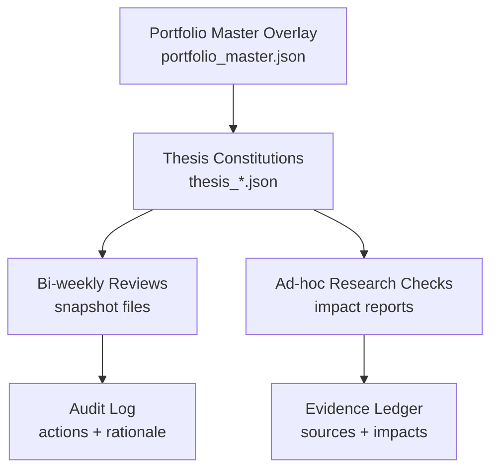

# OpenClaw Investment Thesis System

## Complete Operating Concept (v3.3)

This document defines the full architecture, governance logic, workflows, and file structures of the OpenClaw Investment Thesis System, including the **Portfolio Master overlay**.

Designed for:
- A solo portfolio operator (high rigor, low overhead)
- Evidence-based decisions (no narrative drift)
- AI-assisted validation
- Bi-weekly operating rhythm
- Minimal maintenance burden (“no KPI bloat”)
- Clear separation between **rules** (constitutions) and **runtime state** (reviews/logs)

---

## 1) Core idea in plain English

A “thesis” is treated like **executable logic**, not a story:
- You define a small set of **Structural Pillars** (the load-bearing assumptions).
- You attach a small set of **Primary KPIs** that test those pillars.
- You define **Kill Criteria** with persistence rules (to avoid reacting to noise).
- You define an **Implementation / Expression layer** (what you are allowed to own, and what you must not own).
- You run a **bi-weekly review** that updates KPIs and produces concrete actions.

A separate portfolio-level file (**portfolio_master.json**) acts as a governor:

Verification note:
- Verification is adapters-first (canonical sources). Use web/online retrieval only as a fallback when no adapter source exists.

- it prevents correlated shocks from causing simultaneous “add risk” behavior across multiple theses,
- it enforces cross-thesis overlap rules,
- it provides global guardrails and circuit breakers.

---

## 2) Files and responsibilities

### 2.1 Thesis constitutions (immutable logic)
Each thesis is a “constitution” file (rules, constraints, thresholds). It should change rarely.

Examples (v1.1):
- `thesis_ai_scarcity_infrastructure_v1_1.json`
- `thesis_bitcoin_crypto_rails_v1_1.json`
- `thesis_dividend_quality_compounders_v1_1.json`
- `thesis_energy_systems_transition_v1_1.json`

**What belongs here**
- North Star (core bet + portfolio role)
- Structural Pillars (falsifiable tests + linked KPIs)
- Kill Criteria (binary triggers + persistence)
- KPI definitions (IDs, sources, update cadence, RAG bands)
- Implementation / expression rules (core/satellite/hedges/exclusions)
- Allocation band (target range)
- Governance rules (red-team escalation, overlap constraints, etc.)
- Data policy: `freeze_adds_only` (if primary KPI data is missing)

**What must NOT belong here**
- “Current KPI values”, “this week’s decisions”, “current health”
- Any operational notes or runtime state

### 2.2 Portfolio Master overlay (cross-thesis governance)
`portfolio_master_v1_0.json` is the portfolio-level constitution.

**Responsibilities**
- Circuit breaker for correlated regime shocks
- Action constraints in risk-off mode (pause adds, allow de-risk/hedges)
- Cross-thesis overlap rule (CORE in at most one thesis)
- Global missing-data policy (freeze adds)
- Large-change guardrail (>3% AUM change requires cool-off + one-pager)

### 2.3 Runtime artifacts (append-only logs and snapshots)
These are generated outputs of reviews and research checks. They should be append-only.
- `logs/audit_log.jsonl` — decisions and actions (date, thesis, action, rationale)
- `logs/evidence_ledger.jsonl` — evidence entries (date, source, impact, confidence, mapped pillar/KPI)
- `logs/snapshots/` — per-run snapshots (bi-weekly or ad-hoc), one file per thesis and optional portfolio roll-up

This is where “current” and “historical” reality lives.

---

## 3) Architecture layers and decision hierarchy

### 3.1 Layers (from highest to lowest authority)



### 3.2 Decision precedence (who wins when rules conflict)

1. **Kill Criteria** (thesis-level) override everything for that thesis (exit/pause rules as defined).
2. **Portfolio Master circuit breaker** can restrict actions across theses even if a thesis is green.
3. **Thesis allocation bands** apply unless Portfolio Master temporarily tightens them in risk-off mode.
4. **Implementation / expression rules** remain local to each thesis (allowed vehicles, exclusions, risk constraints).
5. Reviews produce recommendations, but recommendations must remain inside these rule boundaries.

---

## 4) Use cases (explicit) and what each requires from structure

### Use Case 1 — Create a new thesis (high-quality, contradiction-free)
**Goal**
Create a new constitution file that is complete, falsifiable, and implementable.

**Inputs**
- Thesis narrative / research
- Desired role in portfolio
- Initial instruments and constraints

**Outputs**
- New `thesis_*.json` with:
  - 3–5 Structural Pillars (each falsifiable)
  - 3–5 Primary KPIs (each linked to pillars)
  - 1–3 Secondary KPIs (risk controls, not pillar validators)
  - Kill Criteria with persistence filters
  - Implementation/expression layer (core/satellite/hedges/exclusions)
  - Allocation band
  - Data-policy + escalation rules

**Structural requirements**
- Keep KPIs minimal and directly tied to the thesis mechanism.
- Every pillar should have at least one KPI link (or an event-driven flag KPI).
- Sources must be single canonical series + explicit fallback.

### Use Case 2 — Bi-weekly thesis review (research heavy, action oriented)
**Goal**
Validate each thesis against current reality and produce crisp actions.

**Inputs**
- Thesis constitution JSON
- Latest data for KPIs (from canonical sources)
- Macro context (only what moves pillars/KPIs)
- Current allocations (portfolio view)

**Outputs**
- One snapshot per thesis with:
  - KPI values + RAG + deltas
  - Pillar integrity check (intact / weakening / broken)
  - Kill proximity check
  - Concrete actions: buy / add / hold / trim / sell / pause / hedge
- Append entries to:
  - Audit log (actions + rationale)
  - Evidence ledger (sources + impacts)

**Structural requirements**
- Constitutions remain immutable.
- All “current health” and decisions live in snapshots/logs.

### Use Case 3 — New research check (map one report to all four theses)
**Goal**
Given a report, determine:
- which theses are impacted,
- which pillars/KPIs are affected,
- what actions are proposed.

**Inputs**
- Incoming research (report text or summary)
- All thesis constitutions

**Outputs**
- Cross-thesis impact report:
  - Impact state: supporting / strengthening / challenging / invalidating / neutral
  - Affected elements: pillars/KPIs/kill criteria
  - Confidence level and evidence references
- Evidence ledger entries per impacted thesis

**Structural requirements**
- Pillars must be explicit and falsifiable (logic gates).
- KPIs must have stable IDs so impacts can be machine-linked.

### Use Case 4 — Portfolio governance / risk overlay (Portfolio Master)
**Goal**
Prevent portfolio-level failure modes (correlated shock, concentration drift, overlap drift).

**Inputs**
- Thesis review outputs (health + escalation flags)
- Current sleeve weights vs target ranges
- Any major regime indicators (optional)

**Outputs**
- Portfolio mode: normal or risk-off
- Allowed / disallowed action set
- De-risk plan (if circuit breaker triggered)
- Overlap compliance warnings (CORE-in-one-thesis rule)

**Structural requirements**
- Portfolio Master must exist as a separate constitution.
- It must define circuit breaker triggers and exit conditions.
- It must define overlap and large-change guardrails.

---

## 5) Governance rules (the “behavioral firewall”)

### 5.1 Missing data policy (solo-safe)
If primary KPI data is missing:
- **Do not sell solely because a data link broke.**
- Freeze adds: `freeze_adds_only`.
- Continue holding and use last known state, while logging the outage.

### 5.2 Persistence filters
A single data point can be noise.
- Kill Criteria use persistence (e.g., 2 consecutive quarters, 12 months, etc.).
- This prevents false exits due to transient volatility.

### 5.3 Red-team escalation
If any thesis is red, or kill proximity is triggered:
- Run a red-team pass to challenge assumptions and action bias.
- If multiple theses are red simultaneously, Portfolio Master may force risk-off mode.

---

## 6) Portfolio Master (v1.0) — required concept inclusion

### 6.1 Circuit breaker
A portfolio-level guardrail that activates when correlated regime shocks hit multiple sleeves.

**Trigger**
- If **>= 2 theses** enter **RED** status or trigger **kill_proximity escalation** within **7 days**.

**Risk-off mode behavior**
- Allowed: pause adds in risk-on sleeves, reduce exposure toward lower band, add thesis-approved hedges, raise temporary cash buffer.
- Disallowed: increase gross exposure in risk-on sleeves, add new satellite positions, increase single-name concentration.

**Exit condition**
- Return to normal only when fewer than 2 theses remain red for 14 consecutive days.

### 6.2 Overlap rule
If an instrument is held across multiple theses:
- it may be **CORE in at most one thesis**,
- otherwise it must be SATELLITE in the other thesis or explicitly excluded.

### 6.3 Large-change guardrail
Any single action changing exposure by >3% of AUM:
- requires a 48-hour cool-off,
- and a short written rationale (“one-pager”).

---

## 7) v3.2 polish changes already applied in the JSONs

- Bitcoin: tightened MVRV Z bands (separates accumulation vs hold vs trim)
- Dividend: embedded explicit quality-screen definition for reproducibility
- AI: added event-driven regulatory constraint flag KPI to close pillar linkage
- Energy: added 10y real yield secondary risk-control KPI
- All: secondary KPIs are treated as risk controls (pillar-validation semantics removed)
- Portfolio overlay introduced as `portfolio_master_v1_0.json`

---

## 8) Practical project structure (recommended)

```
openclaw/
  portfolio_master.json
  data/
    theses/
      thesis_ai_scarcity_infrastructure.json
      thesis_bitcoin_crypto_rails.json
      thesis_dividend_quality_compounders.json
      thesis_energy_systems_transition.json
  logs/
    audit_log.jsonl
    evidence_ledger.jsonl
    snapshots/
```

Notes:
- Keep the “latest active” filenames stable (without version suffix) and rely on `meta.version` + `version_history` for traceability.
- Store older versions in a `data/theses/archive/` folder if you want explicit file-level versioning too.

---

## 9) How the system stays maintainable (the non-negotiables)
- KPI caps remain tight (avoid “tracking everything”).
- Every KPI has a canonical source + fallback.
- Constitutions are immutable; runtime state is append-only logs/snapshots.
- Data outages freeze adds, not force sells.
- Portfolio Master prevents correlated-shock failure modes.

---

No material uncertainty.